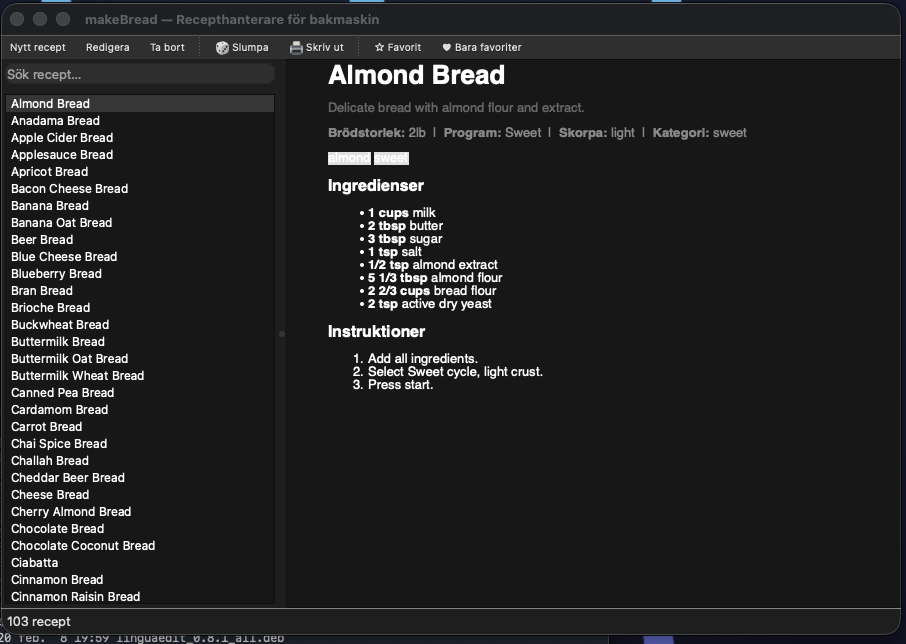
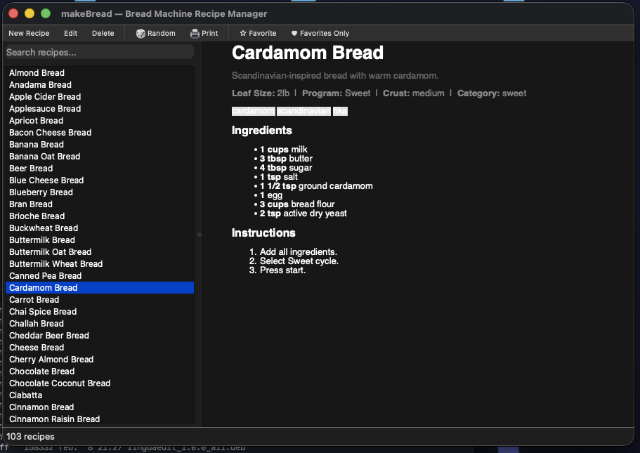
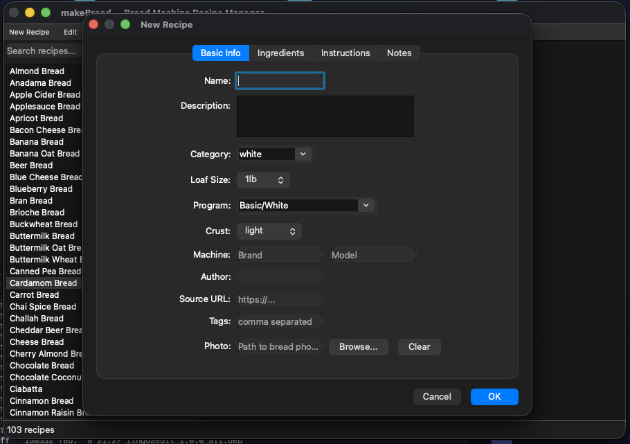

# makeBread 🍞

A simple, clean bread machine recipe manager built with PySide6/Qt6.

## Features

- 📝 Add, edit, and store bread machine recipes
- 🔍 Full-text search by name, ingredient, or category
- 🎲 Random recipe picker — "What should I bake today?"
- 🖨️ Beautiful print-ready recipe cards
- 🏭 Track bread machine model and program settings
- 📏 Unit conversion — US (cups/oz), Metric (dl/g), Imperial
- 📸 Optional photo per recipe
- 📤 Import/export recipes as JSON
- 🌍 Internationalization (gettext) — Swedish translation included
- 🍞 103 built-in starter recipes

## Installation

### Debian/Ubuntu (APT)

```bash
echo "deb [signed-by=/usr/share/keyrings/yeager-keyring.gpg] https://yeager.github.io/debian-repo stable main" | sudo tee /etc/apt/sources.list.d/yeager.list
curl -fsSL https://yeager.github.io/debian-repo/yeager-keyring.gpg | sudo tee /usr/share/keyrings/yeager-keyring.gpg > /dev/null
sudo apt update
sudo apt install makebread
```

### Fedora/openSUSE (RPM)

```bash
sudo dnf config-manager --add-repo https://yeager.github.io/rpm-repo/yeager.repo
sudo dnf install makebread
```

### pip / pipx

```bash
pipx install makebread
# or
pip install makebread
```

### From source

```bash
git clone https://github.com/yeager/makebread.git
cd makebread
pip install -e .
makebread
```

## Usage

```bash
makebread          # Start the app
makebread-gui      # Same thing (explicit GUI entry point)
```

### Settings

Go to **Edit → Settings** (or `Ctrl+,` / `Cmd+,`) to:
- Switch between US, Metric, and Imperial units
- Toggle automatic unit conversion
- Show/hide machine info and category badges

### Contributing Recipes

Submit your favorite bread machine recipes:
1. Open a [GitHub issue](https://github.com/yeager/makebread/issues) with your recipe
2. Email to daniel@danielnylander.se
3. Export as JSON and submit a pull request

## Screenshots

### Main Window


### Recipe Detail


### New Recipe


## Building Packages

### Debian (.deb)

```bash
# On Ubuntu/Debian build machine
./packaging/build-deb.sh
```

### AppCenter / Ubuntu Software

The app includes AppData/MetaInfo (`data/io.github.yeager.makebread.metainfo.xml`)
and a desktop entry (`data/io.github.yeager.makebread.desktop`) for integration
with Elementary AppCenter and Ubuntu Software Center.

## Translations

| Language | Code | Status |
|----------|------|--------|
| English  | en   | ✅ Source language |
| Svenska  | sv   | ✅ Complete |

Want to translate makeBread? See [`makebread/resources/locale/README.md`](makebread/resources/locale/README.md) for instructions.

## License

GPL-3.0-or-later — see [LICENSE](LICENSE) for details.

## Author

Daniel Nylander — [danielnylander.se](https://www.danielnylander.se)

## Support

- ❤️ [GitHub Sponsors](https://github.com/sponsors/yeager)
- 🇸🇪 Swish: +46702526206
