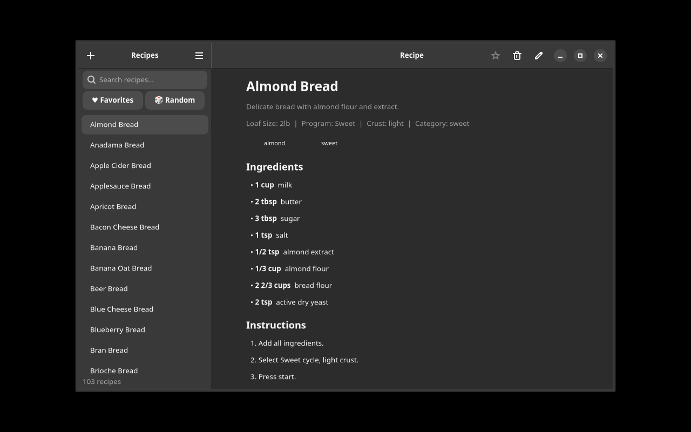

# makeBread 🍞

[](https://github.com/yeager/makebread/releases)
[](https://www.gnu.org/licenses/gpl-3.0)

Bread machine recipe manager with 103 built-in recipes — GTK4/Adwaita.



## Features

- 📝 Add, edit, and store bread machine recipes
- 🔍 Full-text search by name, ingredient, or category
- 🎲 Random recipe picker — "What should I bake today?"
- 🖨️ Print-ready recipe cards
- 🏭 Track bread machine model and program settings
- 📏 Unit conversion — US (cups/oz), Metric (dl/g), Imperial
- 📸 Optional photo per recipe
- 📤 Import/export recipes as JSON (Ctrl+E)
- 🌍 Internationalized (gettext) — Swedish translation included
- 🍞 103 built-in starter recipes

## Installation

### Debian/Ubuntu

```bash
echo "deb [signed-by=/usr/share/keyrings/yeager-keyring.gpg] https://yeager.github.io/debian-repo stable main" | sudo tee /etc/apt/sources.list.d/yeager.list
curl -fsSL https://yeager.github.io/debian-repo/yeager-keyring.gpg | sudo tee /usr/share/keyrings/yeager-keyring.gpg > /dev/null
sudo apt update && sudo apt install makebread
```

### Fedora/openSUSE

```bash
sudo dnf config-manager --add-repo https://yeager.github.io/rpm-repo/yeager.repo
sudo dnf install makebread
```

### From source

```bash
git clone https://github.com/yeager/makebread.git
cd makebread && pip install -e .
makebread
```

## Keyboard Shortcuts

| Shortcut | Action |
|----------|--------|
| Ctrl+Q | Quit |
| Ctrl+F | Search recipes |
| Ctrl+E | Export recipes (JSON) |
| Ctrl+/ | Show keyboard shortcuts |

## Translation

Help translate on [Transifex](https://www.transifex.com/danielnylander/makebread/).

## License

GPL-3.0-or-later — see [LICENSE](LICENSE) for details.

## Author

**Daniel Nylander** — [danielnylander.se](https://danielnylander.se)
